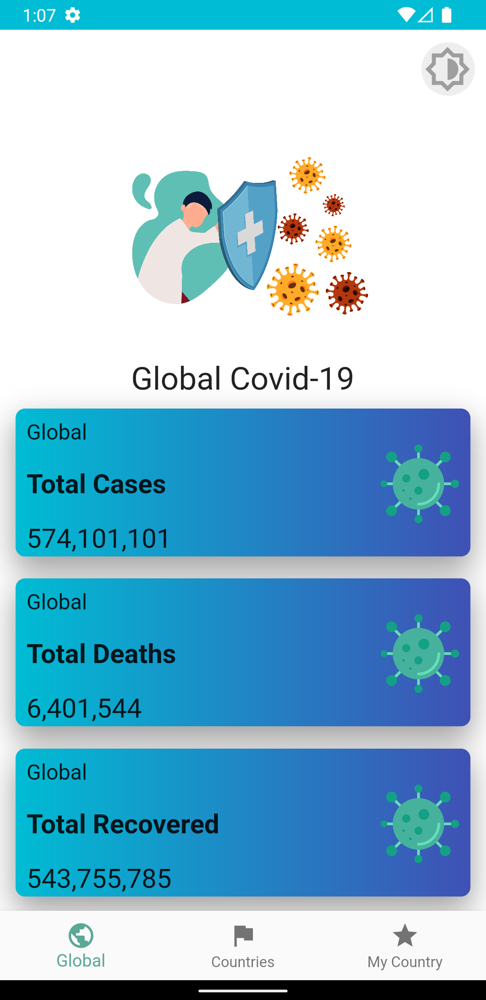
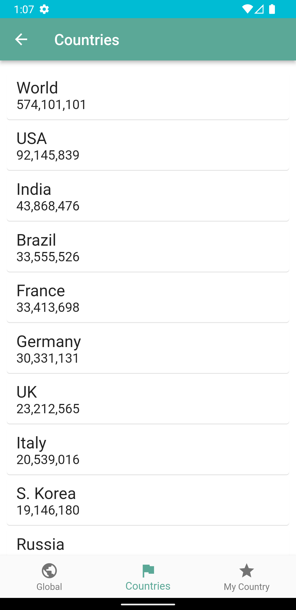
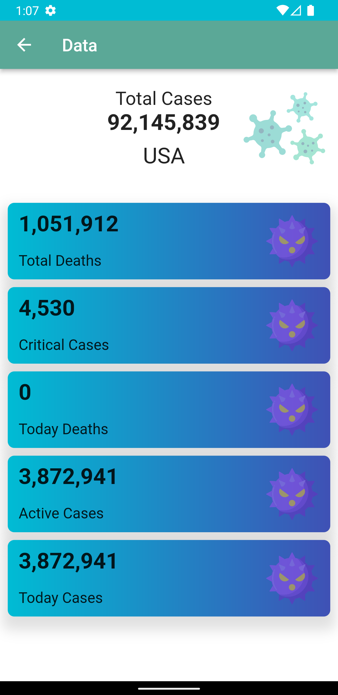
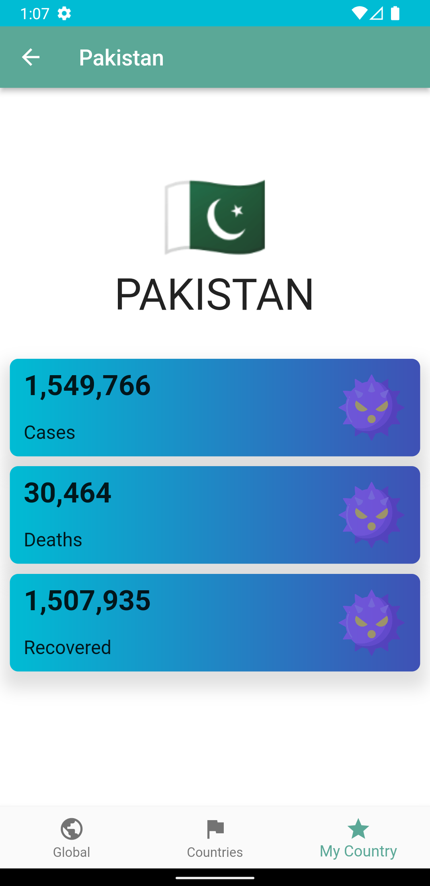
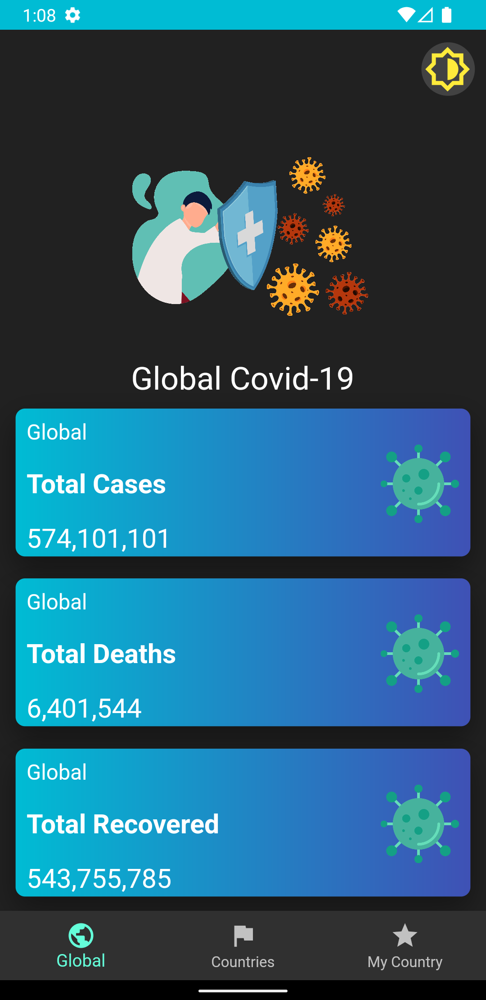
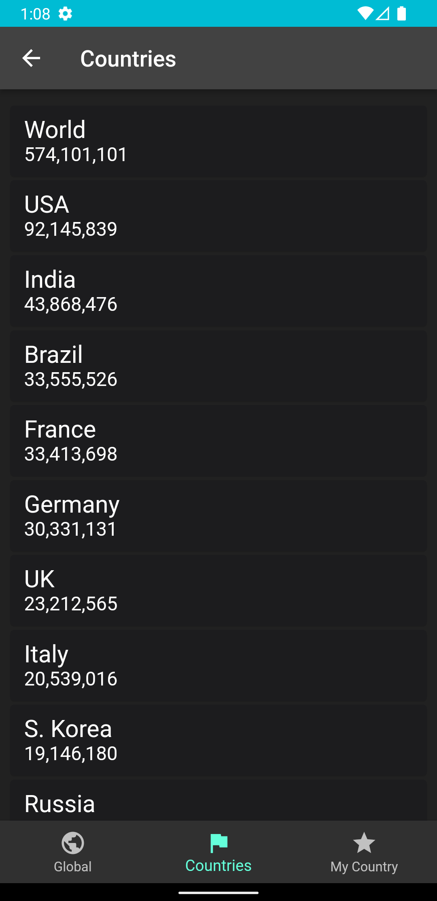
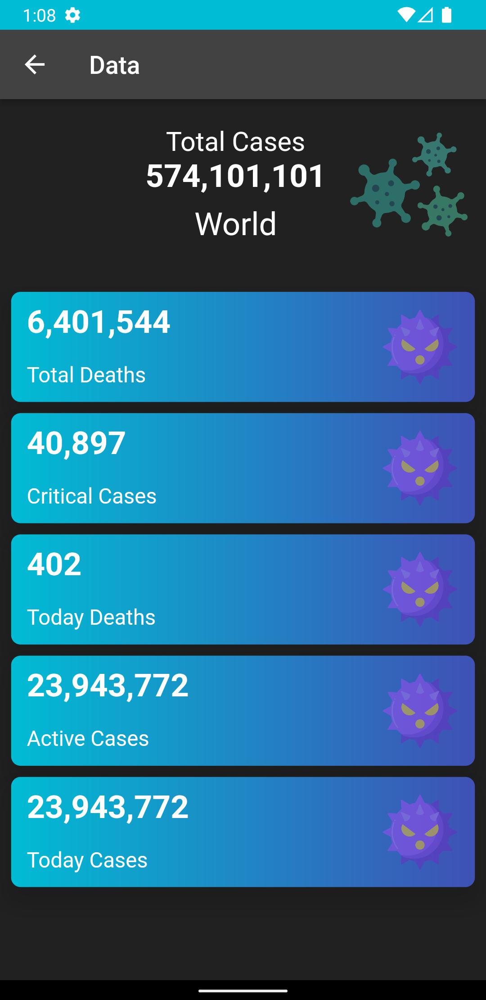
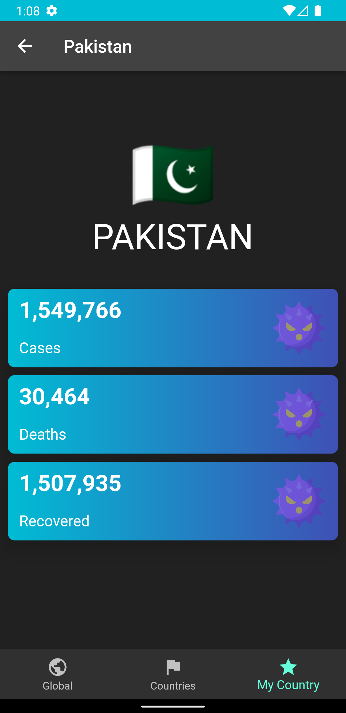

# Covid-19 Tracker

A live trakcer for COVID19 stats across the Globe and also my country Pakistan. It uses APIs so the data is live.
## Screenshots

        

      

## API Reference

For Global data: https://coronavirus-19-api.herokuapp.com/all

For Countries data: https://coronavirus-19-api.herokuapp.com/countries

For Pakistan data: https://coronavirus-19-api.herokuapp.com/countries/pakistan
